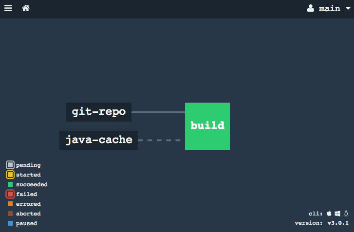

# Java Cache Resource

A http://concourse.ci/[Concourse] resource for caching dependencies downloaded by Java build systems.

## Overview
Java jobs running within Concourse often suffer from speed issues due the fact that each run is started in a fresh container.
The usual cache techniques used by build systems such as Maven and Gradle are rendered useless due to the fact that local directories are not kept between builds.

There's a https://github.com/concourse/concourse/issues/230[long standing issue] to offer first class caching support in Concourse, but in the meantime this resource is designed to alleviate the problem.

### Using the resource
To use the resource you need to configure _two_ inputs into your job.

The first input is the regular `git-resource` that provides access to your repository file.
This resource is usually a `trigger` for your job that causes it to start whenever something is committed to the repository.

The second input is the `java-cache-resource`.
Unlike the `git-resource`, this resource should not `trigger` downstream jobs.
Instead of returning the git repository, the `java-cache-resource` runs some specified build commands and returns a populated cache.

The `java-cache-resource` should be configured with restricted `paths` so that certain commits trigger it.
For example, a typical Maven project would use `"**pom.xml"` so that only changes to `pom.xml` files build a new cache.

.Typical pipeline

Downstream tasks can take the provided cache input and create symlinks to cache directories before running their build.

### Why it works
Concourse workers automatically cache resources that they have previously obtained.
For example, when you run a job you might see `ref	d59962d2` as a resource key, and the message "`using version of resource found in cache`".

We take advantage of this feature to ensure that lengthy download operations only happen when necessary and are cached locally.

## Configuration

### Resource Configuration
To use the `java-cache-resource` you must declare it in the `resource_types` section of your `pipeline.yml` file:

[source,yml]
.Resource configuration
----
resource_types:
  - name: java-cache-resource
    type: docker-image
    source:
      repository: springio/java-cache-resource
      tag: latest
----

The Docker image is built on top of https://hub.docker.com/_/openjdk/[openjdk 8-jdk-alpine].
It contains `java` as well as `git`, but it does not include any build systems.

TIP: We recommend that you use build system wrappers (such as https://docs.gradle.org/current/userguide/gradle_wrapper.html[gradlew] and https://github.com/takari/maven-wrapper[mavenw]) to build your project.
If you need to install an actual build system you can create your own docker image based on this one.

### Source Configuration
The resource builds on and supports the same configuration as https://github.com/concourse/git-resource[git-resource].
We recommend that you use YAML bookmarks to directly share your git configuration.
In addition you need to specify the `folders` you want to cache and the build `commands` that you should run.

* `<<:`: *Required.* The source (references the corresponding git resource)
* `paths`: *Recommended.* The path patterns to consider
* `folders`: *Required.* The `source` and `destination` for cache folders you want to share
* `commands`: *Required.* The build commands that populate the cache
* `cleanup`: Regex patterns that should be removed from the cache

[source,yaml]
.Source configuration
----
resources:
  # Standard git-resource configuration
  - name: git-repo
    type: git
    source: &repo-source # Add a YAML bookmark
      uri: https://github.com/springio/java-cache-resource.git
  # Cache configuration
  - name: java-cache
    type: java-cache-resource
    source:
      <<: *repo-source # Reference YAML bookmark
      paths:
        - "**pom.xml" # Limit to relevant files
      depth: 1
      folders:
        - source: ~/.m2 # Support a source folder ~/.m2
          destination: m2 # Output to 'm2' under the destination
      commands:
        # These commands will populate ~/.m2
        - "./mvnw -DskipTests package dependency:go-offline"
      cleanup:
        # Regular expressions for files/folder to remove
        - ".*SNAPSHOT"
----

## Behavior

### `check`: Check for new commits
The repository is cloned (or pulled if already present), and references to commits for the configured `paths` are returned.

Any commits that contain the string  `[ci skip]`` will be ignored.
This allows you to commit to your repository without triggering a new version.

The version `ref: force` can be used to pick the latest commit (i.e. a one off that ignores `paths`).
You can trigger this from `fly`

----
$ fly -t <target> check-resource -r <pipeline/resource> -f ref:force
----

### `in`: Pulls a git repository and runs commands to populate the cache
Clones the repository to a temporary folder then runs the specified `commands` to populate the cache.
Symlinks from the configured `folders` will be created before the commands are run and `cleanup` is performed afterwards.

For example, the configuration above will effectively do:

----
$ ln -s <destination>/m2 ~/.m2
$ ./mvnw -DskipTests package dependency:go-offline
$ cd <destination>
$ find . | grep ".*SNAPSHOT" | xargs rm -fr
----

### `out`: Nothing to do here....

## Examples
The following examples are included in this repository:

* link:samples/gradle[Gradle] : Shows a typical Gradle pipeline
* link:samples/maven[Maven] : Shows a typical Maven pipeline
* link:samples/simple[Simple] : Provides a basic "`sanity check`" pipeline

## Credits:
* https://github.com/ymedlop/npm-cache-resource[npm-cache-resource]
* https://github.com/concourse/git-resource[concourse git resource]
